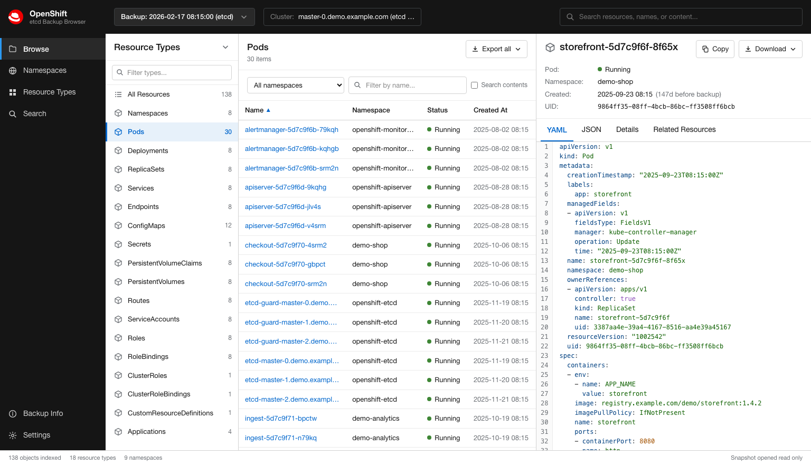

# openshift-etcd-backup-explorer

Browse an OpenShift etcd backup without restoring it.

[](https://github.com/mjovanovic0/openshift-etcd-backup-explorer/actions/workflows/ci.yml)
[](https://pkg.go.dev/github.com/mjovanovic0/openshift-etcd-backup-explorer)
[](LICENSE)

A single Go binary that reads an etcd snapshot file directly and serves a web UI
over it. No etcd to start, no cluster to restore into, and the backup is opened
read only.



## Why

An etcd backup is a [bbolt](https://github.com/etcd-io/bbolt) database holding
every object the API server ever wrote, each value serialized either as
Kubernetes protobuf or as JSON. `etcdctl` can list the keys but prints the
values as binary, so answering "what did this Deployment look like before the
change" normally means restoring the whole cluster somewhere.

This decodes the values in place and gives you a browser over them.

## Scope

Built for and tested against **OpenShift** backups, the pair of files
`cluster-backup.sh` produces:

```
snapshot_2026-09-11_092812.db
static_kuberesources_2026-09-11_092812.tar.gz
```

It should work on **any etcd v3 snapshot** holding Kubernetes objects, including
plain upstream Kubernetes and an `etcdctl snapshot save` taken by hand, because
nothing in the reader is OpenShift specific: it walks the etcd keyspace and
decodes whatever Kubernetes types it finds. That path is **not tested**, since
the only backups on hand are from OpenShift. If you try it on something else,
please [open an issue](https://github.com/mjovanovic0/openshift-etcd-backup-explorer/issues)
and say whether it worked. The parts most likely to need adjusting are the
keyspace prefix, which is `/kubernetes.io` and `/openshift.io` on OpenShift but
`/registry` on upstream Kubernetes, and the resource type ordering, which
favours the types an OpenShift operator reaches for first.

The static resources tarball is optional. Without it you lose the static pod
resources browser and nothing else.

## Install

Download a binary from [releases](https://github.com/mjovanovic0/openshift-etcd-backup-explorer/releases),
or build from source:

```sh
git clone https://github.com/mjovanovic0/openshift-etcd-backup-explorer
cd openshift-etcd-backup-explorer
make build
```

You need Go (the version in `go.mod`) and Node 24 or newer to build.

`go install github.com/mjovanovic0/openshift-etcd-backup-explorer/cmd/openshift-etcd-backup-explorer@latest`
also works, but produces a binary with no web UI, because the built web assets
are not committed. The terminal commands all work; the UI route tells you to run
`make build`.

## Try it without a backup

```sh
make run-demo
```

That generates a synthetic cluster, writes it as a real etcd snapshot, and
serves it. Nothing about it is real, which is the point: it is also what the
screenshots and the test suite use.

## Use

```sh
openshift-etcd-backup-explorer serve -backup ./backup -open
```

`-backup` takes either a folder holding `snapshot_*.db` and
`static_kuberesources_*.tar.gz`, or a single snapshot `.db` file. When the folder
holds several snapshots, every one is indexed and the header lets you switch
between them. It defaults to `./backup`.

The server binds to `127.0.0.1` and has no authentication. See
[SECURITY.md](SECURITY.md) before changing `-addr`.

### What you can do

- **Browse** every object by resource type, with live counts per type.
- Filter by namespace and by name, sort by name, namespace or creation time.
- **Read any object** as YAML or JSON, exactly as the API server stored it, with
  a Details tab that also shows the etcd key, the mod revision, the stored size
  and the storage encoding.
- **Search contents**, not just names. Because both encodings keep strings as
  plain bytes, a raw substring search over the stored values finds objects that
  merely mention a term without paying to decode them first.
- **Follow owner references** in the Related Resources tab, to get from a pod to
  its ReplicaSet and its namespace.
- **Copy or export** one object or every object matching the current filters.
  See [Getting manifests out](#getting-manifests-out).
- **Inspect the backup itself**: etcd version, revision, compact revision,
  consistent index, key and tombstone counts, leases and cluster members.
- **Read the static pod resources** from the tarball taken with the snapshot,
  which holds the manifests and certificates a restore needs.

## Getting manifests out

Exporting takes the filters the list is using, not the page on screen, so
picking PersistentVolumes and choosing Export all gives you all of them, and
adding a namespace or name filter first narrows the export the same way.

In the browser, Export all offers:

| Choice | What you get |
| --- | --- |
| Copy all as YAML | every match on the clipboard as one document stream |
| Download as a folder (zip) | one file per resource at `kind/namespace/name.yaml` |
| Download as one YAML file | a `---` separated stream, ready for `kubectl apply -f` |
| Download as one JSON file | a `v1` `List` holding every object |

From the terminal, `export` writes a real folder tree:

```sh
openshift-etcd-backup-explorer export -kind PersistentVolume -out ./pvs
openshift-etcd-backup-explorer export -kind ConfigMap -namespace openshift-etcd -out ./cms
openshift-etcd-backup-explorer export -kind Secret -q registry -deep -out - > found.yaml
```

It refuses to write into a folder that already holds files unless you pass
`-force`, and writes mode `0600`, because a backup holds secrets.

### What is removed

Copying and exporting remove the fields the API server fills in by itself,
because a manifest taken out of a backup is meant to be read or applied
somewhere else:

- `metadata.uid`
- `metadata.creationTimestamp`
- `metadata.managedFields`
- inside nested templates, such as a Deployment's pod template,
  `managedFields` and a `creationTimestamp` that is null

Nothing else is touched. A `uid` that points at a *different* object, such as a
PersistentVolume's `spec.claimRef.uid`, is a reference rather than generated
metadata, so it stays. Owner references stay too.

Two things are never changed: the YAML and JSON tabs always show the object
exactly as the backup holds it, and downloading the raw etcd value always gives
the stored bytes. Turn the whole behaviour off under Settings, or pass
`-keep-generated` to `export`.

## Terminal use

Every question the UI answers is also available without a browser:

```sh
openshift-etcd-backup-explorer info                        # snapshot, keyspace and member facts
openshift-etcd-backup-explorer kinds                       # every resource type with counts
openshift-etcd-backup-explorer kinds -by-count | head -20  # the types taking the most space
openshift-etcd-backup-explorer ls -kind Pod -namespace openshift-etcd
openshift-etcd-backup-explorer ls -kind ConfigMap -q prometheus -deep    # search contents
openshift-etcd-backup-explorer get -kind ConfigMap -namespace openshift-etcd -name etcd-pod
openshift-etcd-backup-explorer export -kind PersistentVolume -out ./pvs
openshift-etcd-backup-explorer demo -out ./demo-backup     # a synthetic backup to try
```

`-kind` accepts a bare Kind such as `Pod`, and reports the options when a Kind
exists in more than one API group, or a full id such as `apps/v1/Deployment`.

## How it works

```
snapshot_*.db  (bbolt)
  └── bucket "key"    one entry per revision, value is mvccpb.KeyValue
        └── KeyValue.value
              ├── "k8s\0" + runtime.Unknown   built in and OpenShift types
              └── {...}                       custom resources, stored as JSON
```

**Reading the keyspace** (`internal/snapshot`). bbolt is opened read only. Keys
in the `key` bucket are revision ordered, so one forward walk keeps the newest
revision of each key and drops the tombstoned ones. `mvccpb.KeyValue` is parsed
by hand, which keeps the etcd server and gRPC out of the dependency tree.

**Indexing** (`internal/index`, `internal/kube`). The etcd key alone is
ambiguous, because `/kubernetes.io/<group>/<resource>/<name>` and
`/kubernetes.io/<resource>/<namespace>/<name>` have the same shape. The value is
authoritative instead: the protobuf envelope carries the apiVersion and kind, and
`ObjectMeta` always sits at field 1 of the object body. Those fields are read
directly, so indexing a full cluster snapshot needs no generated types and takes
about a second for 23,000 objects. Only metadata is held in memory; object
bodies stay in the file and are read back on demand.

**Decoding** (`internal/kube/decode.go`). The Details, YAML and JSON views need
the real object, so a `runtime.Scheme` is built from every `k8s.io/api` group
version plus every OpenShift group, and the Kubernetes protobuf serializer
decodes against it. Custom resources are already JSON and pass through. When no
Go type is compiled in, which happens for a type removed from the Kubernetes
libraries such as `PodSecurityPolicy`, the fallback still recovers and shows
`ObjectMeta` and says why the rest is missing. On a real 372 MiB OpenShift
snapshot this decodes 173 of 174 resource types in full.

**Status column.** Kubernetes has no single status field, so
`internal/kube/status.go` holds a small set of per kind rules (pod phase, ready
replicas, job outcome, Argo CD health and sync) and falls back to the standard
condition list. Status needs the decoded object, so it is computed only for the
rows being returned, not for the whole index.

## Development

```sh
make dev       # Go API on :8080, Vite on :5173 with /api proxied
make test      # go test plus a TypeScript build
make test-ci   # the way CI runs: the generated fixture only
make help      # every target
```

The protobuf parsing is checked by round tripping objects through the real
Kubernetes serializer, so the hand written readers are tested against the exact
bytes an API server writes.

See [CONTRIBUTING.md](CONTRIBUTING.md). The one rule worth repeating here:
**never commit a real backup**, and take screenshots from `make demo`.

## A note on secrets

An etcd backup contains every Secret in the cluster, stored unencrypted unless
the cluster enabled encryption at rest. This tool will show them. Treat the
backup, and this tool's output, as sensitive. See [SECURITY.md](SECURITY.md).

## License

[Apache 2.0](LICENSE), Copyright 2026 Milan Jovanović.
